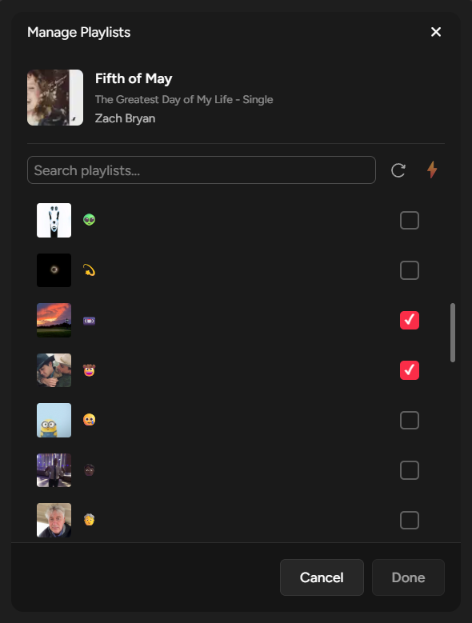
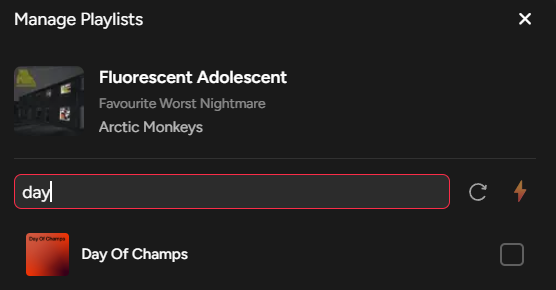
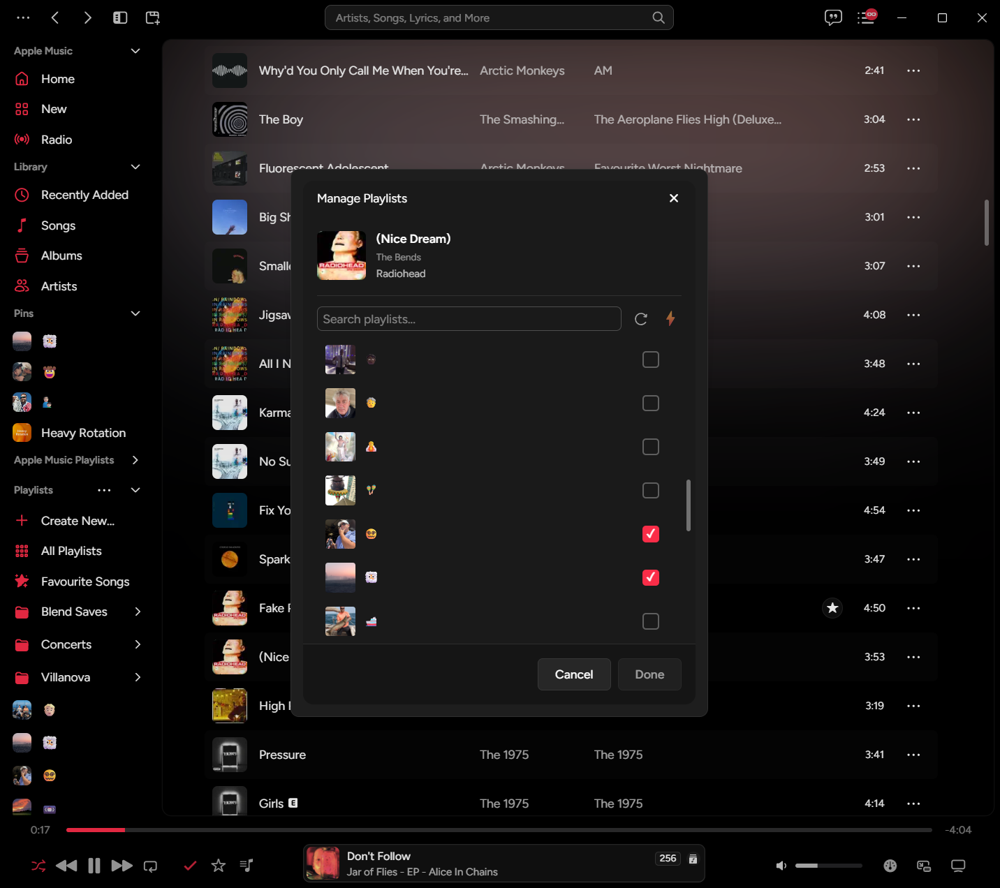
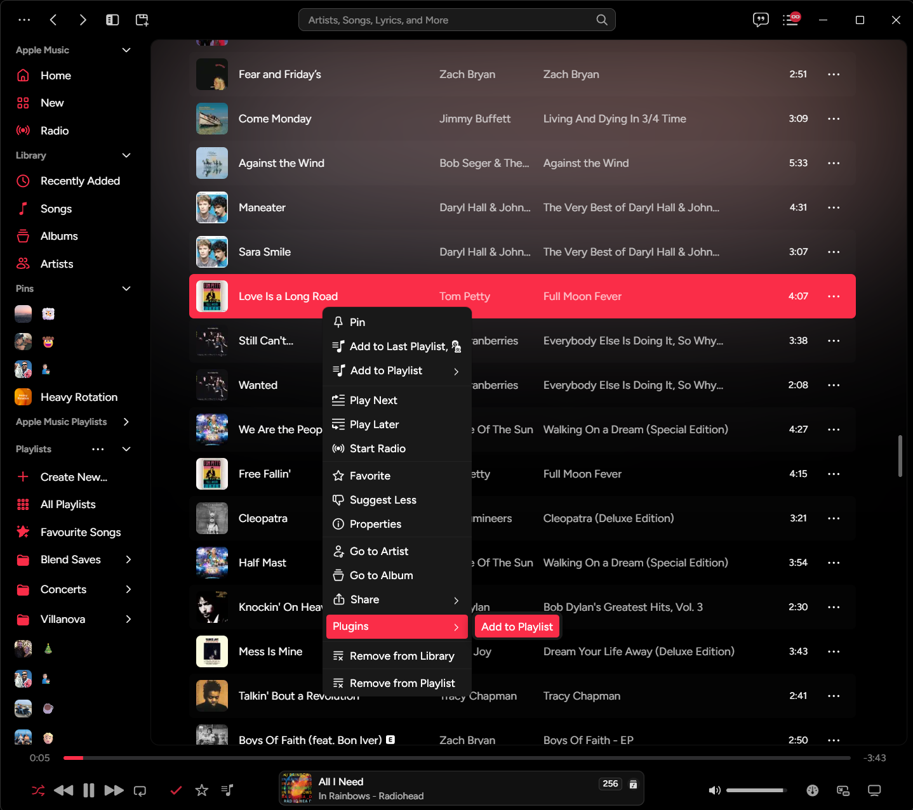
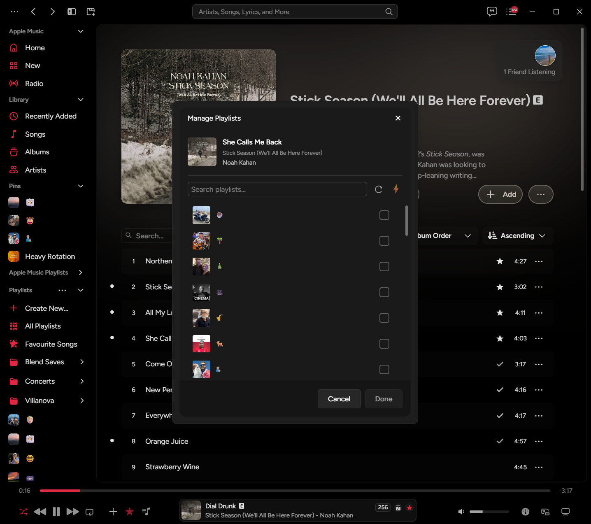

# Cider Playlist Manager

A powerful Cider plugin that makes managing your Apple Music playlists effortless with an intuitive inline interface and batch playlist operations.

## Features


### 🎯 Inline "Add to Playlist" Button and Replaces Native Cider Button For Now Playing Songs

Hover over any track to reveal a quick-access button that lets you add songs to multiple playlists instantly. You can also add to a playlist by using the native "Add to Playlist" button in Cider on a now playing song.


### 📋 Batch Playlist Management

Add or remove songs from multiple playlists at once with a clean, checkbox-based interface. See which playlists already contain your song at a glance.



### 🔍 Smart Playlist Search

Quickly find the playlists you're looking for with built-in search functionality.



### 🎨 Clean, Modern UI

Seamlessly integrates with Cider's design language with smooth transitions and hover effects.



### ⚡ Context Menu Integration

Right-click on any song to access the playlist manager directly from the context menu.



### 🎵 Track Detection

Works across common views - playlists and albums.



> Note: This plugin currently does not work in search results or on artist pages, just in albums and playlists.

## Installation

1. Download the latest release from the [Releases page](https://github.com/brendeni1/cider-song-playlist-manager/releases)
2. Open Cider and navigate to ... (top-left of window) → Settings → Extensions → Plugins
3. Click "..." and select "Open AppData Folder"
4. In the opened folder, navigate to `plugins`
5. Drop the `brendeni1.song-playlist-manager` folder from the `.zip` you downloaded from the [Releases page](https://github.com/brendeni1/cider-song-playlist-manager/releases) into the `plugins` directory
6. Back in Cider, click the "..." again and select "Refresh Plugins List", and then enable the plugin when it pops up.
7. Enjoy your enhanced playlist management!

## Known Issues

### Search Results & Album Pages
- **Adding tracks from search results and artist pages**: This plugin currently does not work with artist pages and search results. Anyone with more knowhow (I made this with Sonnet 4.5 and didn't feel like learning the languages sorry 😜) can feel free to make a PR.
- **Album view limitations**: While the button appears on album pages, track identification may occasionally fail for certain albums. If you encounter issues, try adding the song from a playlist view instead.

## Disclaimer

⚠️ **Important**: This plugin modifies your Apple Music library playlists. While it has been tested, I am not responsible for any damaged, corrupted, or lost playlists that may occur from using this plugin.

**Strongly recommended**: 
- Use [Hezel](https://apps.apple.com/us/app/hezel-for-apple-music/id6472612361) or similar tools to regularly backup your Apple Music library and playlists
- Test the plugin with non-critical playlists first
- Always verify changes after batch operations

By using this plugin, you acknowledge that you do so at your own risk. Always maintain regular backups of your music library.

## Usage

### Quick Add via Inline Button

1. Hover over any track in your library, playlists, or albums
2. Move your cursor to where the duration time is displayed
3. The "**+**" button will appear
4. Click to open the playlist manager

### Managing Playlists

1. In the playlist manager modal, check or uncheck playlists
2. Playlists where the song already exists are pre-checked
3. Modified playlists are highlighted
4. Click "Done" to apply your changes

### Context Menu

1. Right-click on any track
2. Select "Add to Playlist" from the context menu
3. The playlist manager will open for that song

## Features in Detail

- **Smart Filtering**: Automatically filters out Apple Music system playlists (Favorites, Rotations, etc.) to show only your editable playlists
- **Real-time Status**: See which playlists already contain your song with instant visual feedback
- **Batch Operations**: Make multiple playlist additions/removals in a single operation
- **Change Tracking**: Visual indicators show which playlists you've modified before saving
- **Optimized Performance**: Efficient API calls with smart batching for large playlist collections
- **Responsive Design**: Works seamlessly on different screen sizes

## Keyboard Shortcuts

- `ESC` - Close the playlist manager modal
- Click outside modal - Close without saving changes

## Compatibility

- **Cider Version**: 2.0.0+
- **Apple Music**: Requires an active Apple Music subscription
- **Platforms**: Windows, macOS, Linux

## Development

### Building from Source

```bash
# Install dependencies
pnpm install

# Build the plugin
pnpm build

# Development mode with watch
pnpm dev
```

### Project Structure

```
cider-playlist-manager/
├── src/
│   ├── components/
│   │   └── PlaylistManagerModal.vue   # Main modal component
│   ├── main.ts                         # Plugin entry point
│   └── plugin.config.ts                # Plugin configuration
├── dist/                               # Built plugin files
└── README.md
```

## Technical Details

- Built with Vue 3 Composition API
- Uses Cider PluginKit API for seamless integration
- TypeScript for type safety
- Integrates with Apple Music API via Cider's authenticated endpoints

## Troubleshooting

**Button not appearing:**
- Make sure you're hovering over a track in your library or playlists
- Check that the plugin is enabled in Cider settings

**Can't add to certain playlists:**
- Apple Music system playlists (like Favorites) are read-only and filtered out
- Make sure you have edit permissions for the playlist

**Changes not saving:**
- Ensure you have an active internet connection
- Check that you're signed in to Apple Music
- Verify the playlist isn't corrupted

## Contributing

Contributions are welcome! Please feel free to submit a Pull Request.

1. Fork the repository
2. Create your feature branch (`git checkout -b feature/AmazingFeature`)
3. Commit your changes (`git commit -m 'Add some AmazingFeature'`)
4. Push to the branch (`git push origin feature/AmazingFeature`)
5. Open a Pull Request

## License

This project is licensed under the MIT License - see the [LICENSE](LICENSE) file for details.

## Acknowledgments

- Built for [Cider](https://cider.sh) - An open-source Apple Music client
- Uses the Cider PluginKit API
- Inspired by the need for better playlist management in music players

## Support

If you encounter any issues or have feature requests, please [open an issue](https://github.com/yourusername/cider-playlist-manager/issues).

---

Made with ❤️ for the Cider community
